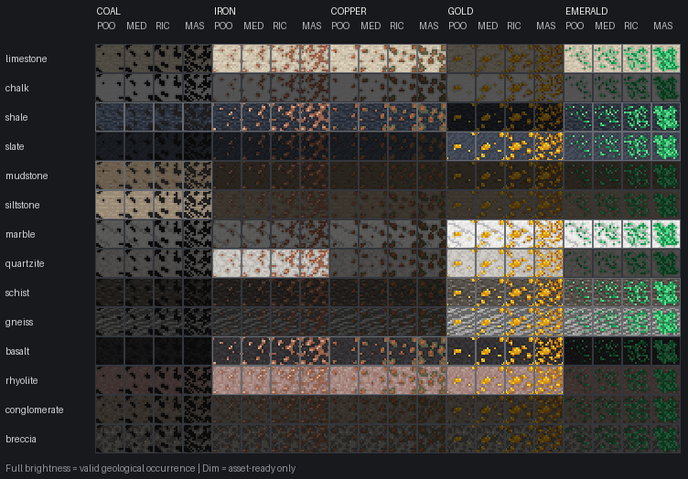
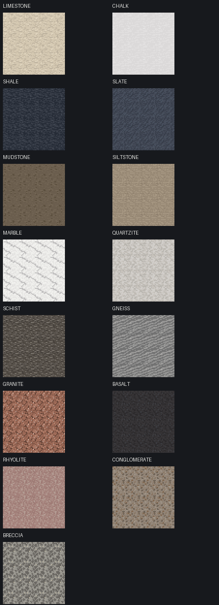
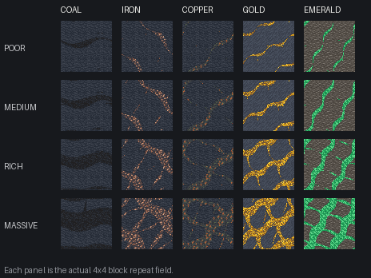

# Ore and mineral system

GeoStrata is staging a geology-driven ore system. The stable occurrence contract
is `data/geostrata/geology/ore_occurrences.json`, loaded and validated with the
rest of the server-data geology graph. Real deposit placement now exists behind
a separate disabled-by-default experiment; ordinary GeoStrata worlds remain on
the pre-deposit baseline unless a datapack explicitly opts in.

## Current implemented boundary

The catalog currently defines the phase-one materials coal, iron, copper and
gold. Each occurrence declares:

- the mod that owns the material economy;
- the canonical output item;
- valid GeoStrata host lithologies;
- valid geological province contexts; and
- one or more deposit styles.

The supported styles are deliberately limited to `coal_seam`, `vein`,
`stratiform`, `disseminated` and `massive_lens_or_pocket`. Data reload fails if
an occurrence references an unknown lithology, province or style. Use
`/geostrata ore <material>` to inspect the loaded occurrence contract.

`OreDepositCandidatePlanner` divides the world into deterministic 256×256×64
candidate cells. For each material and cell it derives one jittered anchor and
one style from the occurrence's allowed styles without consuming Minecraft
feature RNG state. The candidate cell is therefore stable regardless of chunk
generation order.

`OreDepositGeometry` gives each declared style a distinct body: low-dip coal
sheets, branched tubular veins, broad stratiform lenses, sparse disseminated
envelopes and compact massive lenses/pockets. The seed derives orientation,
scale, warp and the two restrained side branches used by veins. The body sampler
grades economic blocks from edge to core, applies stable block-coordinate
dithering at grade boundaries and represents the surrounding halo or
disseminated host gaps as non-economic Trace.

The older anchor-host qualification path remains useful to diagnostics, but
runtime placement deliberately does not read a remote candidate anchor block
from another chunk. Active placement first checks the candidate's geological
province, then clips each economic voxel to a locally present host lithology
allowed by that material. This avoids chunk-loading/order hazards and lets a
single body cross a geological contact while preserving the correct host state
on each placed ore block.

### Experimental deposit placement

`data/geostrata/geology/ore_deposit_experiment.json` is the explicit activation
boundary. The bundled resource has `enabled=false`. A test datapack may replace
that resource with `enabled=true`; no code or client resource pack is required.
The feature is registered across the overworld but returns immediately while the
contract is disabled, so the normal generated-world baseline is unchanged.

The initial activation probability is intentionally conservative and applies to
each material's deterministic 256×256×64 candidate cell before province and
host clipping:

| Material | Candidate activation |
| --- | ---: |
| Coal | 4.0% |
| Iron | 2.5% |
| Copper | 1.8% |
| Gold | 0.8% |

These are experiment values, not a promised economy. The bodies are much larger
than vanilla single-feature ore blobs, so high candidate frequency would swamp
the graded yield model before abundance has been measured in fresh worlds.

Placement is chunk-local. Every generated chunk re-evaluates the nearby stable
candidate cells, builds any active body whose conservative bounds intersect the
chunk, samples only the clipped local volume, and writes only that chunk's
valid-host economic voxels. It never reaches into a neighboring chunk to finish
a body. The neighboring chunk independently reaches the same deterministic
answer when it generates, which removes cross-chunk mutation ordering from the
shape.

Direct GeoStrata rock blocks resolve their lithology from the loaded catalog. If
the separate correlated sedimentary experiment owns a chunk, ore placement can
also resolve the correlated field against its vanilla host-replacement tag. That
allows an ore voxel to acquire the correct future host identity even when ore
placement runs before the companion sedimentary replacement feature; the later
sedimentary pass will not overwrite the graded ore block.

Trace remains evidence-only and does not place a block. Vanilla/provider-native
ore generation is still **not suppressed**. This experiment exists to measure
body abundance, readability, performance and economic coverage before GeoStrata
is allowed to become the exclusive generation owner.

## Grade contract

`trace` is reserved for non-economic evidence. The four economic grade names
are fixed, in ascending order:

1. `poor`
2. `medium`
3. `rich`
4. `massive`

Every phase-one material has one registered block for each economic grade.
Grades share the same economics across materials:

| Grade | Base output | Mining XP |
| --- | ---: | ---: |
| Poor | 1 | 0–1 |
| Medium | 2 | 1–2 |
| Rich | 4 | 2–4 |
| Massive | 8 | 4–8 |

The block loot tables apply Minecraft's standard `ore_drops` Fortune formula.
Silk Touch returns the exact graded block and suppresses mining XP through the
normal Minecraft mining path. Material still determines the canonical output
and minimum tool tier; host rock does not alter yield or XP.

These numbers are a fixed core contract at this stage, not independently
reloadable tuning. Resource reload validates the declared values, and repository
validation cross-checks them against every bundled loot table. Making economics
fully datapack-driven would require a custom loot function so actual drops cannot
drift from the catalog.

Every graded ore block stores a stable `host` block-state property. Its model
selects one flat 16x16 composite texture for that host, material and grade; the
renderer does not stack raised ore panels over a generic rock. Silk Touch copies
the host property into the dropped block item so replacing it preserves the
correct host appearance.

`data/geostrata/materials/ore_texture_matrix.json` is the artist-facing source
of truth. It declares all rock hosts, the four ordered density targets, each
material's default item-model host and the subset of hosts that geology may
actually generate. `scripts/generate_ore_texture_matrix.py` combines:

1. one native 16x16 host tile in `textures/block/host`;
2. one native 16x16 dense mineral source in `ore_source/master`;
3. nested Poor, Medium, Rich and Massive masks; and
4. a restrained one-pixel integration rim derived from the host.

The script writes the transparent grade overlays, all host/material/grade
composites, block models, blockstates and item-model defaults. Generated PNG and
JSON assets are committed; Pillow is an authoring dependency only and is not
required by Minecraft or a resource pack. Repository validation requires exact
16x16 dimensions, complete model coverage, increasing density and agreement
between `validHosts` and the runtime ore-occurrence catalog.

The bundled host and mineral tiles are placeholder art in a restrained vanilla
Minecraft visual language. They are deliberately separated from generated
composites so an artist can replace a host or mineral source and regenerate the
whole matrix without editing hundreds of final textures by hand.

Every host source is also checked as a self-contained seamless 16x16 tile. Its
wrap-edge contrast may not exceed the ordinary contrast inside the texture by a
conspicuous margin, preventing a bright or dark grid from appearing across a
large exposure. Ore composites inherit the same host edge, so they remain
compatible with adjacent host blocks and with normal Minecraft rendering.

The development pack already includes Continuity `3.0.0+1.20.1` and Indium.
When Continuity is active, generated `method=random` definitions select one of
four subtle variants for each host. Only the inner 12x12 pixels vary; the
two-pixel edge guard is byte-identical to the base host. This reduces obvious
single-tile repetition without creating a seam where a varied host touches a
fallback host or a graded ore composite. Continuity remains a client-side visual
enhancement rather than a core GeoStrata dependency: without it, the base tile
and all host/material/grade composites still render normally.

### Connected ore tilesets

Graded ores use a separate topology-aware Continuity layer so exposed deposits
can read as one mineral body instead of a grid of repeated single-block ore
sprites. The authoring layout follows the composable-subtile approach described
in [Pixel Art Game Tileset made easier](https://www.sandromaglione.com/articles/pixel-art-game-tileset-made-easier): artists maintain a small set of reusable
pieces and the generator assembles the renderer-facing tiles.

Each material owns one 40x24 RGBA source sheet at
`textures/block/ore_source/tileset/<material>.png`. The sheet contains thirteen
8x8 subtiles:

```text
outer_nw  border_n  outer_ne  | inner_nw  inner_ne
border_w  center    border_e  | inner_sw  inner_se
outer_sw  border_s  outer_se  |
```

That gives one center, four borders, four outer corners and four inner corners.
`scripts/generate_ore_continuity_tilesets.py` derives the four grade densities
from those sources and composes the five sprites defined by Continuity's
`ctm_compact` method:

0. unconnected / isolated block;
1. fully connected interior;
2. vertical connection;
3. horizontal connection; and
4. connected sides with an unconnected diagonal corner.

The generated properties match one material, grade and host state, but use
`connect=block`. Therefore adjacent blocks of the same material and grade can
connect across a host-rock boundary while each block keeps the correct local
host-rock composite. A grade boundary remains a visible concentration boundary
because Poor, Medium, Rich and Massive are distinct block IDs.

Only combinations listed in each material's `validHosts` are emitted. Phase one
therefore produces 76 host/material/grade CTM definitions and 380 generated
16x16 sprites instead of filling the texture atlas with combinations that
geology cannot place. The ordinary flat host-aware ore textures remain the
renderer-independent fallback for every state.

A second `repeat` rule is deliberately not chained after the compact CTM rule.
The compact topology already handles horizontal runs, vertical runs, corners and
large connected interiors; layering a coordinate-repeat transform on top would
make rule ordering renderer-dependent and weaken compatibility. Larger-scale
variation should instead be added by extending the artist source tiles or with a
CTM-supported variation scheme that preserves the same connection topology.

Generated assets are committed and covered by
`data/geostrata/materials/ore_ctm_manifest.json`. The manifest hashes the four
artist sheets, every generated property file and sprite, and the preview so a
source edit cannot silently leave stale renderer assets. Regenerate with
`python3 scripts/generate_ore_continuity_tilesets.py`; normal CI validates the
committed output with `python3 scripts/validate_ore_continuity_tilesets.py`
without installing Pillow.

`docs/images/host-tiling-preview.png` is regenerated with the matrix and shows
four-by-four block exposures without cell outlines. It is the quick visual check
for borders, framed tiles and high-contrast repetition.
`docs/images/ore-ctm-tileset-preview.png` shows the five compact CTM outputs for
each grade and material using its default host.







Full-bright cells are currently permitted by geological occurrence rules. Dim
cells are generated and asset-ready but will not occur naturally unless the
occurrence catalog is expanded later.

## Ownership and compatibility

GeoStrata is the intended overworld generation owner for every enabled ore or
mineral occurrence. The provider mod continues to own the material's item,
recipes and processing economy. Phase one uses Minecraft outputs; a future
provider-backed entry such as Create zinc should remain dormant unless its
provider is installed, then generate through GeoStrata while dropping the
provider-compatible material.

Provider-native ore generation must only be suppressed after the experimental
replacement deposits have demonstrated acceptable availability and economy.
Suppressing first would create worlds with missing resources. External host-rock
compatibility should extend a stable host/semantic contract rather than replace
registered block IDs after startup.

## Staged implementation path

1. **complete** — validate phase-one host, province, style and output contracts.
2. **complete** — implement deterministic deposit candidates from world seed
   and geological context without mutating blocks;
3. **complete** — add Poor/Medium/Rich/Massive block, loot, yield and XP behavior
   with Trace as non-economic evidence;
4. **complete** — construct and sample deterministic style-specific bodies,
   concentration, dithered grades and non-economic Trace without mutating blocks;
5. **complete, experimental opt-in** — place deterministic bodies chunk-locally,
   clip them to valid host lithologies and expose conservative abundance tuning
   while leaving the default world and native ore generation unchanged;
6. suppress overlapping native generation only when replacement coverage is
   proven by fresh-world abundance/economy tests; and
7. add guarded provider-mod occurrences without transferring ownership of their
   item economies into core GeoStrata.
